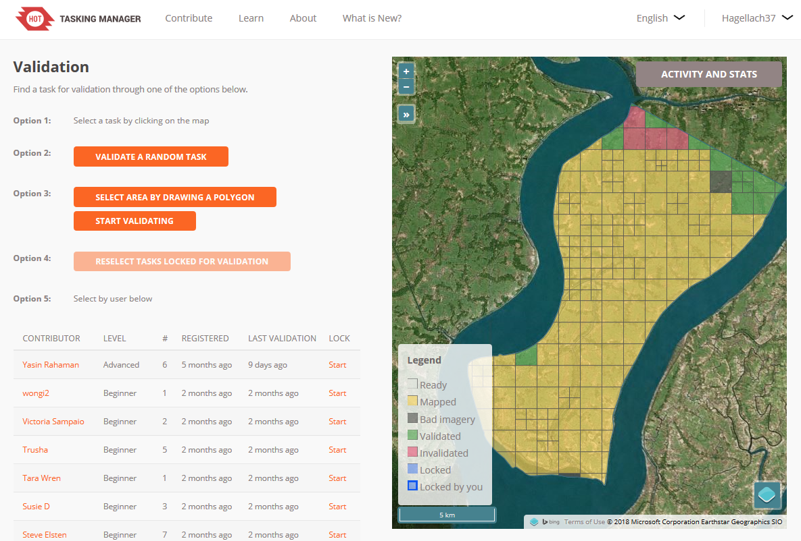

# Introducing the Critical Numbers Project for the HOT Tasking Manager 

We would like to introduce our new little analysis tool ["Critical Numbers"](https://disastertools.heigit.org/critical_numbers/) for projects of the HOT Tasking Manager. The Critical Numbers webapp is an easy way to visualize how much of a project is mapped and validated in percent as a simple bar chart. Data can also be downloaded as GeoJSON for further processing in QGIS or other applications. It retrieves this data from the [HOT-Tasking-Manager API](https://tasks.hotosm.org/api-docs).

The HOT Tasking Manager is an excellent effort to organize tasks around crowdsourced mapping efforts.
To describe it in their own words:

> The Tasking Manager is a mapping tool designed and built for the Humanitarian OpenStreetMap Team's collaborative mapping process in OpenStreetMap. The purpose of the tool is to divide up a mapping project into smaller tasks that can be completed rapidly with many people working on the same overall area. It shows which areas need to be mapped and which areas need the mapping validated ([HOT Tasking Manager](https://tasks.hotosm.org/about))


*Figure 1: Screenshot of the Critical Numbers tool*

## Motivation

Mapping roads, buildings and other infrastructures remotely from satellite imagery are important steps to enable humanitarian organizations to become active in disaster affected or vulnerable regions. In the last couple of years we have seen an increase in mapping tasks in the HOT Tasking Manager. For big projects such as Missing Maps more than [50,000 volunteers mapped roughly 30 million buildings and 800,000 roads](http://www.missingmaps.org/leaderboards/#/missingmaps) within the last 4 years. That's impressive!


*Figure 2: Missing Maps stats obtained from missingmaps.org*

However, with the sharp increase in mapping activity and many beginners starting to contribute to OpenStreetMap, validation of the created data is getting even more urgent. Already in 2017 Missing Maps members started the [#ValidationFriday](https://twitter.com/hashtag/ValidationFriday?src=hash&lang=de) to tackle this issue. 

The goal of the ["Critical Numbers"](https://disastertools.heigit.org/critical_numbers/) application is to get a quick overview of how much was mapped and validated for any number of projects. A simple bar chart is chosen to visualize those numbers. This will help project managers to identify projects which require more attention during the validation phase. For example, we can find projects which are mapped 100% but have very little validation. Little validation hiders the completion of the project. Even worse the likelihood that the mapped information is wrong or not accurate is bigger. Let's try get those projects validated.


*Figure 3: A completely [mapped project](https://tasks.hotosm.org/project/4007) which needs validation*

## How to use the Critical Numbers tool

Usage of the webapp is pretty straight forward:

1. Choose HOT-Tasking-Manager projects by either Campaign Tag (e.g. "Missing Maps") or Organisation Tag (e.g. "KLL"). It is even possible to select distinct projects by by their IDs (e.g. "3473").
2. Press the submit button.
3. A bar chart will be generated and displayed. This could take a while depending on the number of projects.

The outcome will be a simple bar chart. A map will also be displayed to show which areas are mapped.

### Examples

Below are sample bar charts of the organizations British Red Cross, Médecins Sans Frontières, Humanitarian OpenStreetMap Team and the campaign tag Missing Maps. (Click on the charts to view in fullscreen and for a little bit of interactivity.)

British Red Cross currently has 5 projects in the Tasking Manager. They are located in Nepal and Bangladesh. On average the projects are mapped to 80%, but still need more validators. Only 5% of the overall area of the projects have been validated. Médecins Sans Frontières (MSF) have created 45 projects in the Tasking Manager, the Humanitarian OpenStreetMap Team (HOT) 143 projects, and all Missing Maps members together 278 projects. Both HOT and MSF have a strong presence in Africa. HOT especially in the eastern part, MSF more in subsaharan countries and DRC. Missing Maps projects can be found almost everywhere. In terms of validation we see a lot projects which have been mapped *and* validated completely. But still, the average amount of validated tasks in a Missing Maps project is around 40%.


## Download Data as GeoJSON for detailed Analysis: 

On the website visualized projects can be download as GeoJSON. This can be useful for further analysis of displayed projects. The GeoJSON has following structure and information:

```json
{
  "features": [
    {
      "geometry": {
        "coordinates": [...], 
        "type": "MultiPolygon"
      }, 
      "properties": {
        "apiRequestTimestampUTC": "2018-06-21 09:37", 
        "campaignTag": "Missing Maps", 
        "name": "Missing Maps: Dhangadi, Kailali, Nepal 1", 
        "organisationTag": "British Red Cross", 
        "percentMapped": 99, 
        "percentValidated": 15, 
        "projectId": 3675, 
      }, 
      "type": "Feature"
    }
  ], 
  "type": "FeatureCollection"
}
```

### Example Analysis

A low percentage of validated tasks for a specific project might not always be a problem. It's just normal to do the mapping first and validate in the next step. But sometimes that *next step* never happens. Let's try not to forget those projects. Our preconception is that the projects, which are mapped 100% but have very little validation are stagnating. To investigate this issue further necessary to find out exactly which projects are affected. This Chapter will therefor depict a GIS Analysis using QGIS to answer the question:

- Are there projects which are mapped almost 100% but are lacking validation completely?

In the first step let's get the data into QGIS:
1. Display the bar chart of the campaign tag Missing Maps using the webapp
2. Download the data of displayed projects as GeoJSON using the "Download Data" button of the webapp
3. Load the GeoJson into QGIS


In the second step we filter the projects which have been mapped completely (100%), but only little validation (<20%) has taken place. We can get this with following parameters using the select by expression tool of QGIS:

```"percentMapped" = 100 AND "percentValidated" < 20```


As can be seen in the Attribute Table 40 of 290 projects are mapped 100%, but have almost no validation. There are even projects with zero validation. This is an easy way to detect projects, where validation is needed and which are probably stagnating.


## Conclusion

With the Critical Numbers webapp it is easy to get an overview of how much is mapped and validated of ongoing projects in the HOT-Tasking Manager.

The project including usage guide and hosting instruction is on GitHub. Right now its just a little bit more than a proof of concept, but the project is open for ideas and contributions. Just [post an issue](https://github.com/GIScience/hot-tm-critical-numbers/issues) or contact us directly. :)

---

> **Additional insights**
> - When running the application Critical Numbers locally, you can retrieve all projects of HOT-Tasking Manager as GeoJSON using the command line. The command for this is: `python -m cli getall`.
> - There exists some projects which are mapped more than 100%?! That is an issue of the HOT-Tasking Manager. (Probably this is caused by splitting up task geometries after the initial import.)
