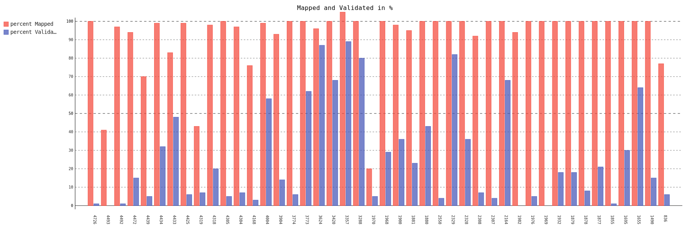

# Introducing the Critical Numbers Project for the HOT Tasking Manager 

We would like to introduce our new little analysis tool for projects of the HOT Tasking Manager.

The HOT Tasking Manager is an excellent effort to organize tasks around crowdsourced mapping efforts.
To describe it in there own words:

> The Tasking Manager is a mapping tool designed and built for the Humanitarian OpenStreetMap Team's collaborative mapping process in OpenStreetMap. The purpose of the tool is to divide up a mapping project into smaller tasks that can be completed rapidly with many people working on the same overall area. It shows which areas need to be mapped and which areas need the mapping validated ([HOT Tasking Manager](https://tasks.hotosm.org/about))

The Critical Numbers webapp is an easy way to visualize how much of a project is mapped and validated in percent as a simple bar chart. It retrieves this data from the HOT-Tasking-Manager API.


## Motivation

There are projects which are mapped 100% but have very little validation. Little validation hiders the completion of the project. Even worse the likelihood that the mapped information is wrong or not accurate is bigger.

The goal of the application developed is to get a quick overview of how much was mapped and validated of any number of projects. A simple bar chart is chosen to visualize those numbers.


# Usage

Usage of the webapp is pretty straight forward:

1. Choose HOT-Tasking-Manager projects by either Campaign Tag or Organisation Tag. It is even possible to select distinct projects by by their IDs.
2. Press the submit button.
3. A bar chart will be generated and displayed. This could take a while depending on the number of projects.

The outcome will be a simple bar chart. A map will also be displayed to show which areas are mapped.


## Examples

Below are sample bar charts of the organizations British Red Cross, Médecins Sans Frontières, Humanitarian OpenStreetMap Team and the campaign tag Missing Maps. (Click on the charts to view in fullscreen and for a little bit of interactivity)





# GIS Analyse

On the website visualized projects can be download as GeoJSON. This can be useful for further analysis of displayed projects.

The GeoJSON has following structure and information:

```json
{
  "features": [
    {
      "geometry": {
        "coordinates": [...], 
        "type": "MultiPolygon"
      }, 
      "properties": {
        "apiRequestTimestampUTC": "2018-06-21 09:37", 
        "campaignTag": "Missing Maps", 
        "name": "Missing Maps: Dhangadi, Kailali, Nepal 1", 
        "organisationTag": "British Red Cross", 
        "percentMapped": 99, 
        "percentValidated": 15, 
        "projectId": 3675, 
      }, 
      "type": "Feature"
    }
  ], 
  "type": "FeatureCollection"
}
```


## Example Analysis

A preconception is that the projects, which are mapped 100% but have very little validation are stagnating. To investigate this issue further necessary to find out exactly which projects are affected.

This Chapter will therefor depict a GIS Analysis using QGIS to answer the question:

- Are there projects which are mapped almost 100% but are lacking validation?

First step is to get the data into QGIS:
1. Display the bar chart of the campaign tag Missing Maps using the webapp
2. Download the data of displayed projects as GeoJSON using the "Download Data" button of the webapp
3. Load the GeoJson into QGIS


Second step is to filter the projects with following parameters using the select by expression tool of QGIS:
- mapped = 100%
- validated < 20%


As can be seen in the Attribute Table 40 of 290 projects are mapped 100%, but have almost no validation. There are even projects with zero validation.

This is an easy way to detect projects, where validation is needed and which are probably stagnating.


# Conclusion

With the Critical Numbers webapp it is easy to get an overview of how much is mapped and validated of ongoing projects in the HOT-Tasking Manager.

The project including usage guide and hosting instruction is on GitHub. Right now its just a little bit more than a proof of concept, but the project is open for ideas and contributions.

---

> **Additional insights**
> - When running the application Critical Numbers locally, you can retrieve all projects of HOT-Tasking Manager as GeoJSON using the command line. The command for this is: `python -m cli getall`.
> - There exists some projects which are mapped more than 100%?! That is an issue of the HOT-Tasking Manager.
